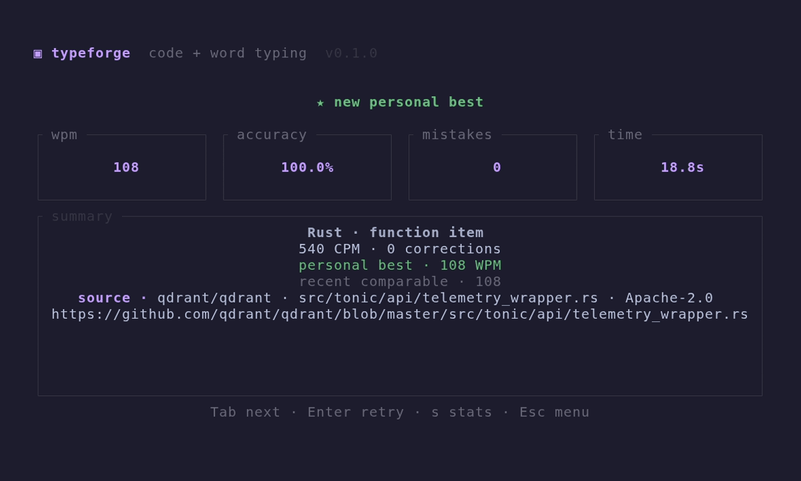

# TypeForge

Focused terminal typing practice for words and real source code.

TypeForge finds permissively licensed GitHub repositories, extracts complete language structures with tree-sitter, removes comments, normalizes indentation, and keeps source attribution attached. Word sessions use pinned Monkeytype lists. Settings, history, personal bests, and mistake diagnostics stay local.

[](https://github.com/rzssh/typeforge/actions/workflows/ci.yml)

[](assets/demo.gif)

_Recorded demo is automated; displayed speed measures playback, not human performance._

## Install

Requires Rust 1.88 or newer.

```sh
cargo install --git https://github.com/rzssh/typeforge --tag v0.1.0 --locked
typeforge
```

Run from a checkout instead:

```sh
cargo run --release
```

GitHub permits unauthenticated discovery at a lower rate. Set a token when refreshing code frequently:

```sh
GITHUB_TOKEN=... typeforge
```

## Features

- English and Russian word practice using 200, 1k, 5k, and 10k lists;
- timed and word-count sessions;
- Python, JavaScript, TypeScript, Rust, Go, Swift, Kotlin, C++, C#, and Java code practice;
- complete functions, classes, interfaces, implementations, and related structures instead of arbitrary line slices;
- terminal syntax highlighting;
- strict correction and free-typing modes;
- optional code autopairs for `()`, `[]`, and `{}`;
- single-keystroke handling for indentation and formatter alignment padding;
- stable wrapped word view and source-line scrolling for code;
- native blinking or steady bar, block, and underline carets;
- live WPM, accuracy, error count, and prominent session progress;
- retry and next-session flow without returning to setup;
- anonymous multiplayer rooms with synchronized countdowns, live opponents, reconnects, and race results;
- line-linked cumulative WPM graphs with per-line pace and inline mistake review;
- comparable personal best and five recent results;
- persistent settings, session history, character timing, weak-character ranking, and confusion tracking;
- duplicate and recent-repository avoidance;
- bounded cache with offline fallback after content has been downloaded;
- repository, path, URL, and SPDX license attribution for every code result;
- corrupt statistics preserved separately instead of overwritten.

## Controls

### Setup

- `↑` / `↓` or `j` / `k`: select
- `←` / `→` or `h` / `l`: change
- `Enter`: apply or start
- `r`: fetch another code repository
- `m`: create or join a multiplayer room
- `s`: statistics
- `q` or `Esc`: quit

### Multiplayer

- `↑` / `↓`: select name, room code, join, or create
- `r`: toggle ready in a lobby
- `Enter`: join/create, or start the countdown as host
- `Esc`: leave the room

Run a relay and point each client at it:

```sh
typeforge relay 0.0.0.0:8787
TYPEFORGE_SERVER=ws://relay.example:8787 typeforge
```

For a public relay, terminate TLS with a reverse proxy and use a `wss://` URL. Invitations are copyable commands:

```sh
typeforge join ABC123
```

### Session

- `F2`: switch between expected and typed text
- `Ctrl-R` or `F3`: restart the current session
- `Backspace`: remove one character
- `Ctrl-W`, `Ctrl-Backspace`, or `Alt-Backspace`: remove one word
- `Ctrl-U`: remove current line
- `Tab`: next session
- `Esc`: return to setup

### Results

- `a`: analyze the current result
- `Enter`: retry same content
- `Tab`: next session
- `s`: statistics
- `Esc`: setup

## Content pipeline

```text
GitHub repository search
→ license and file filtering
→ tree-sitter structure extraction
→ comment removal
→ indentation and size normalization
→ attributed local cache
→ typing session
```

Repository discovery accepts MIT, Apache-2.0, BSD-2-Clause, BSD-3-Clause, and ISC projects. Word practice downloads exact files from a pinned Monkeytype commit. See [`THIRD_PARTY_NOTICES.md`](THIRD_PARTY_NOTICES.md) for provenance and licensing details.

## Local data

TypeForge stores downloaded content under the platform cache directory and settings/statistics under the platform data directory, each in a `typeforge` subdirectory. Solo sessions never upload typing history. Multiplayer sends the shared content and live race metrics to the configured relay; rooms are held only in relay memory.

Minimum terminal size is 64×20. Caret shape and blink use native terminal controls, so exact rendering depends on the terminal. A network connection is needed to download a word list or find the first code snippets for a language; valid cached content remains usable offline.

## Check

```sh
cargo fmt --all -- --check
cargo clippy --all-targets --all-features --locked -- -D warnings
cargo test --locked
cargo build --release --locked
```

Network checks are ignored by default:

```sh
cargo test --locked -- --ignored --test-threads=1
```

## Scope

TypeForge supports local practice and anonymous live races: restored setup, wrapped word/source-line presentation, configurable native caret, live feedback, correction controls, synchronized rooms, retry/new-session flow, comparable results, attribution, and durable local history. It deliberately has no accounts, cloud sync, persistent leaderboards, themes, gamification, or generated adaptive drills.
